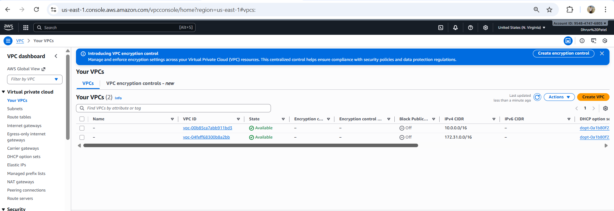

# Deploying AWS Infrastructure with Terraform and CloudFormation

## Project Overview
This project demonstrates Infrastructure as Code (IaC) best practices by deploying a scalable AWS infrastructure using both Terraform and CloudFormation. The infrastructure includes S3 buckets, VPC, EC2 instances, and RDS database instances.

**Course:** PROG 8870 - Cloud Architectures and Infrastructure as Code  
**Name:** Dhruv  
**Student ID:** 9062297

---

##  Repository Structure

```
Deploying-AWS-Infra-with-TF-and-CF/
├── terraform/
│   ├── main.tf                    # Root module configuration
│   ├── provider.tf                # AWS provider configuration
│   ├── variables.tf               # Variable definitions
│   ├── backend.tf                 # Backend configuration (local state)
│   ├── terraform.tfvars           # Variable values (gitignored)
│   └── modules/
│       ├── s3/
│       │   ├── main.tf           # S3 bucket resources
│       │   ├── variables.tf      # S3 module variables
│       │   └── outputs.tf        # S3 module outputs
│       ├── vpc/
│       │   ├── main.tf           # VPC, subnets, IGW, route tables
│       │   └── outputs.tf        # VPC module outputs
│       ├── ec2/
│       │   ├── main.tf           # EC2 instance resource
│       │   ├── variables.tf      # EC2 module variables
│       │   └── outputs.tf        # EC2 module outputs
│       └── rds/
│           ├── main.tf           # RDS instance and subnet group
│           ├── variables.tf      # RDS module variables
│           └── outputs.tf        # RDS module outputs
├── cloudformation/
│   ├── s3.yaml                   # S3 buckets template
│   ├── vpc-ec2.yaml              # VPC and EC2 template
│   └── rds.yaml                  # RDS database template
├── rds-parameters.json           # CloudFormation RDS parameters
├── .gitignore                    # Git ignore file
└── README.md                     # This file
```

---

##  Terraform Deployment

### Prerequisites
- AWS CLI installed and configured
- Terraform v1.0+ installed
- AWS credentials configured (`~/.aws/credentials` or environment variables)
- Valid EC2 key pair created in AWS

### Terraform Resources Created

#### **1. S3 Module (4 Private Buckets)**
- 4 private S3 buckets with versioning enabled
- Bucket naming: `{prefix}-bucket-{1-4}`
- No public access

#### **2. VPC Module**
- Custom VPC (CIDR: 10.0.0.0/16)
- 1 Public subnet (10.0.1.0/24) in us-east-1a
- 2 Private subnets:
  - 10.0.2.0/24 in us-east-1a
  - 10.0.3.0/24 in us-east-1b
- Internet Gateway
- Route tables and associations
- Security group for EC2 (allow SSH on port 22)

#### **3. EC2 Module**
- EC2 instance (t3.micro)
- Amazon Linux 2 AMI
- Public IP enabled
- SSH access via security group

#### **4. RDS Module**
- MySQL database (db.t3.micro)
- Engine: MySQL 8.0
- 20 GB storage
- DB subnet group with private subnets
- Security group allowing MySQL traffic (port 3306) from EC2
- **Not** publicly accessible (secure configuration)

### Step-by-Step Deployment

#### 1. Clone the Repository
```bash
git clone <your-repo-url>
cd Deploying-AWS-Infra-with-TF-and-CF/terraform
```

#### 2. Create `terraform.tfvars`
Create a file named `terraform.tfvars` with the following content:

```hcl
aws_region     = "us-east-1"
bucket_prefix  = "9062297"
ami_id         = "ami-0c02fb55956c7d316"  # Amazon Linux 2, us-east-1
instance_type  = "t3.micro"
db_name        = "dhruvdb"
db_username    = "admin"
db_password    = " "  
```
## Terraform Deployment

#### 3. Initialize Terraform
```bash
terraform init
```

This downloads the AWS provider and initializes the backend.

#### 4. Validate Configuration
```bash
terraform validate
```

#### 5. Plan Deployment
```bash
terraform plan
```

Review the resources that will be created.

#### 6. Apply Configuration
```bash
terraform apply
```

Type `yes` when prompted. Deployment takes approximately 5-10 minutes.

#### 7. View Outputs
```bash
terraform output
```

Expected outputs:
- S3 bucket names
- VPC ID
- EC2 public IP
- RDS endpoint


### Cleanup Terraform Resources
```bash
terraform destroy
```

Type `yes` to confirm deletion of all resources.

---
## Screenshots of terraform deployment

### Terraform apply in terminal:


### Terraform modules in AWS Console:





##  CloudFormation Deployment

### Prerequisites
- AWS CLI installed and configured
- Valid AWS credentials
- EC2 key pair named `dhruv-key` (or update template)

### CloudFormation Resources Created

#### **1. S3 Stack (3 Private Buckets)**
- 3 private S3 buckets
- Versioning enabled
- PublicAccessBlockConfiguration applied
- Bucket names: `9062297-bucket-{1-3}`

#### **2. VPC/EC2 Stack**
- VPC with DNS support enabled (CIDR: 10.0.0.0/16)
- 1 Public subnet (us-east-1b)
- 2 Private subnets (us-east-1c, us-east-1d)
- Internet Gateway and route tables
- EC2 instance (t3.micro) with public IP
- Security group for SSH access

#### **3. RDS Stack**
- MySQL RDS instance (db.t3.micro)
- DB subnet group across 2 AZs
- Security group for MySQL (port 3306)
- Publicly accessible (for project demo purposes)

### Step-by-Step Deployment

1. **Deploy S3 Buckets:**
```bash
   aws cloudformation create-stack --stack-name dhruv-s3-stack --template-body file://cloudformation/s3.yaml
```

2. **Deploy VPC and EC2:**
```bash
   aws cloudformation create-stack --stack-name dhruv-vpc-stack --template-body file://cloudformation/vpc-ec2.yaml
```

3. **Deploy RDS:**
   - Update `rds-parameters.json` with VPC and subnet IDs from VPC stack outputs
```bash
   aws cloudformation create-stack --stack-name dhruv-rds-stack --template-body file://cloudformation/rds.yaml --parameters file://rds-parameters.json
```

### Verify Deployment
```bash
aws cloudformation list-stacks --stack-status-filter CREATE_COMPLETE
```

### Cleanup
```bash
aws cloudformation delete-stack --stack-name dhruv-rds-stack
aws cloudformation delete-stack --stack-name dhruv-vpc-stack
aws cloudformation delete-stack --stack-name dhruv-s3-stack
```
## Screenshots:

### CloudFormation deployment in terminal:


### CloudFormation deployment in AWS Console: 


## Key Features

### Terraform Implementation
- **Modular Architecture:** Reusable modules for each service
- **Dynamic Configuration:** All values configurable via variables
- **Local State Management:** State stored locally as per requirements
- **Security Best Practices:** Private RDS, security groups properly configured

### CloudFormation Implementation
- **Parameterized Templates:** Flexible deployment with parameters
- **YAML Format:** Clean, readable template syntax
- **Stack Dependencies:** Proper resource ordering
- **Outputs:** Important information exported for reference

### Security Highlights
- Private S3 buckets with public access blocked
- Security groups with least-privilege access
- RDS in private subnets (Terraform) or with security group (CloudFormation)
- SSH access restricted to EC2 instances
- Sensitive variables properly handled

---

##  Troubleshooting

### Common Issues

#### Terraform: State Lock Error
```bash
# If state is locked, force unlock (use with caution)
terraform force-unlock <LOCK_ID>
```

#### CloudFormation: VPC DNS Error
Ensure VPC has DNS support enabled:
```bash
aws ec2 modify-vpc-attribute --vpc-id <VPC_ID> --enable-dns-support
aws ec2 modify-vpc-attribute --vpc-id <VPC_ID> --enable-dns-hostnames
```

#### RDS: Password Requirements
MySQL passwords must:
- Be 8+ characters
- Contain only: letters, numbers, and `! # $ % ^ & * ( ) _ + - = [ ] { } | \`
- NOT contain: `/ @ " ' space`

#### EC2: Key Pair Not Found
Update the `KeyName` in templates to match  existing EC2 key pair.

---

##  Comparison: Terraform vs CloudFormation

| Feature | Terraform | CloudFormation |
|---------|-----------|----------------|
| **Language** | HCL (HashiCorp Configuration Language) | YAML/JSON |
| **State Management** | Explicit state file | Managed by AWS |
| **Modularity** | Excellent (modules) | Good (nested stacks) |
| **Multi-Cloud** | Yes | AWS only |
| **Learning Curve** | Moderate | Easy for AWS users |
| **Preview Changes** | `terraform plan` | Change sets |
| **Community** | Large, active | AWS-focused |

---


